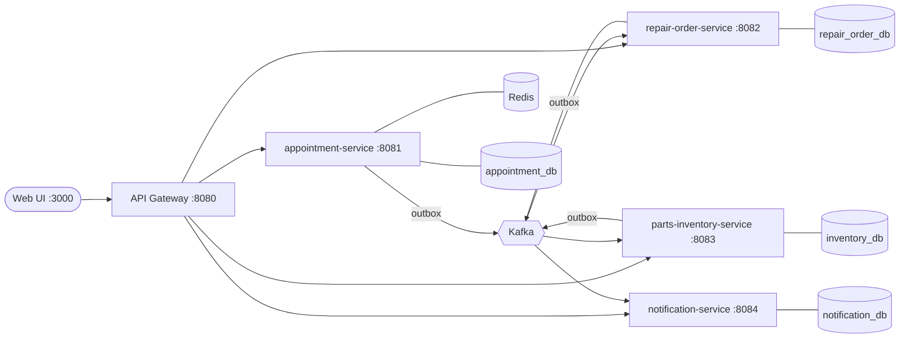

<div align="center">

# Torqline

**Service appointments and repair orders for car and bike dealerships**

Java 21 · Spring Boot 4 · Kafka · PostgreSQL · Redis · React 19 · TypeScript · Docker

</div>


Torqline is a small but realistic dealership service platform. A customer books a slot for their **car or bike**,
the workshop checks the vehicle in, a job card opens automatically, parts are reserved from the dealer's stock,
and the customer gets an itemised GST invoice and SMS updates along the way.

It's built as event-driven microservices and runs on a laptop with one command. It focuses on the problems real
workshops have, such as double-booked bays, retries that create duplicate bookings, and jobs promising parts that
aren't on the shelf, and it solves each one in a way that's tested and measured.

---

## Contents

- [Features](#features)
- [Screenshots](#screenshots)
- [Quick start](#quick-start)
- [Architecture](#architecture)
- [Engineering highlights](#engineering-highlights)
- [Testing](#testing)
- [Project structure](#project-structure)
- [Documentation](#documentation)
- [Troubleshooting](#troubleshooting)
- [Roadmap](#roadmap)

---

## Features

| For | What they can do |
|---|---|
| **Customers** | Choose bike or car, see only the services that apply to that vehicle, pick a day and a free slot, book, and get an SMS confirmation |
| **Service advisors** | See the day's appointments, check vehicles in (with odometer reading), run a live job-card board, assign technicians, request parts, complete jobs and print invoices |
| **Parts desk** | See stock per part with reserved vs available, get low-stock alerts, restock |
| **Everyone** | A live feed of every SMS and email the system sent |

**How cars and bikes differ**

| | Car | Bike |
|---|---|---|
| Bays | Car lifts | Bike stands |
| General service | 120 min | 60 min |
| Labour rate | ₹800 / hour | ₹400 / hour |
| Vehicle-only jobs | Wheel alignment, AC service | Chain and sprocket kit |
| Parts | Car parts + universal consumables | Bike parts + universal consumables |

## Screenshots

| Workshop board | Parts inventory |
|---|---|
|  |  |
| **Printable GST invoice** | **Messages sent (SMS / email)** |
|  |  |

## Quick start

**You need:** [Docker Desktop](https://www.docker.com/products/docker-desktop/) with at least 6 GB of memory. Java, Maven
and Node are **not** required; everything builds inside Docker.

```bash
make up
```

The first build takes 1-2 minutes. Then open **http://localhost:3000**.

| URL | What |
|---|---|
| http://localhost:3000 | Web app |
| http://localhost:8080/api | REST API through the gateway |
| http://localhost:8081/swagger-ui.html | API docs for appointments (8082 repair orders, 8083 inventory, 8084 notifications) |
| http://localhost:8090 | Kafka UI (run `make tools` first) |
| `localhost:5433` | PostgreSQL, user and password `torqline` |

**A two-minute tour:**

1. **Book service**: pick *Bike*, *General service*, tomorrow, any slot, then confirm. The 🔔 lights up with the SMS.
2. **Workshop**: click **Check in** on that appointment. A job card appears on the board.
3. **Start work** → **Add parts** (engine oil + brake pads) → the card waits briefly while inventory reserves the stock.
4. **Complete** → **Invoice** → **Print**. You get an itemised invoice with 18% GST.
5. **Inventory**: the stock you used is gone, and a low-stock alert may have been emailed to the manager.

Things to try: book the same bike slot three times at Indiranagar (it has only two bike stands), or request two
chain kits at Indiranagar (only one is in stock). See the [user guide](docs/USER-GUIDE.md) for more.

**Everyday commands**

```bash
make help       # list all commands
make demo       # the same end-to-end flow as a script against the API
make test       # all backend and frontend tests
make logs       # follow service logs
make down       # stop (keeps data)
make reset      # stop and delete all data
```

**Developing in an IDE**

```bash
make infra      # start only Postgres, Redis and Kafka
```

Run any `*Application` class from IntelliJ (JDK 21, e.g. `brew install --cask temurin@21`), and run the UI with hot
reload using `make ui-dev` (http://localhost:5173). Defaults in each `application.yml` point at `localhost`.

## Architecture



| Service | Responsibility |
|---|---|
| **gateway** | Single entry point, routing, request IDs |
| **appointment-service** | Dealers, bays, slot availability, booking, check-in, cancellation |
| **repair-order-service** | Job cards, status workflow, parts requests, invoice totals |
| **parts-inventory-service** | Stock, reservations, consumption, low-stock alerts |
| **notification-service** | Turns events into customer SMS and manager emails |
| **web** | React UI served by nginx, which also proxies `/api` |

Each service owns its own database. Services talk only through events, never through each other's tables.
The full design is in the [high-level design](docs/HLD.md) and the [low-level design](docs/LLD.md).

## Engineering highlights

**1. No double booking, proven under load.**
A PostgreSQL exclusion constraint makes it impossible for one bay to hold two overlapping bookings, even
across several service instances. Load testing found that this alone **deadlocks** under heavy contention: 50
simultaneous requests produced 49 errors. Adding a per-bay advisory lock fixed it. The k6 race now gives exactly 4
bookings for 4 bays and 46 clean `409 Slot unavailable` responses. See [ADR-001](docs/adr/001-double-booking-prevention.md).

**2. Events that are never lost or invented.**
A transactional outbox writes each event in the same database transaction as the change it describes. A relay publishes
it to Kafka, and every consumer skips duplicates. See [ADR-002](docs/adr/002-transactional-outbox.md).

**3. A parts saga with compensation.**
Stock is reserved all-or-nothing before work continues, consumed when the job completes, and released if it's
cancelled. Row locks are taken in a fixed order so two jobs can't deadlock over the same parts.

**4. Safe retries.**
Booking takes an `Idempotency-Key`, so a double-click or a retry after a timeout returns the original booking.

**5. Fast reads.**
Availability is cached in Redis and falls back to PostgreSQL if Redis is down. It measures **p95 ≈ 3 ms at 200 req/s** locally.

**6. AI-assisted, human-verified.**
The design docs were drafted with an AI assistant and then checked. The [AI review log](docs/AI-REVIEW.md) records
what it got wrong and how each mistake was caught.

## Testing

| Suite | Count | Command |
|---|---|---|
| Backend unit + integration (JUnit 5, Mockito, MockMvc, Testcontainers) | 59 | `make test-backend` |
| Frontend unit + component (Vitest, React Testing Library) | 29 | `make test-web` |
| End-to-end API walkthrough | 13 steps | `make demo` |
| Load and race test (k6) | 2 scenarios | `make loadtest` |

`make test` runs both suites. Coverage reports go to `*/target/site/jacoco/index.html` (backend) and
`web/coverage/index.html` (`make coverage-web`). Details are in the [testing guide](docs/TESTING.md).

## Project structure

```
torqline/
├── torqline-common/          shared event contracts, outbox, idempotent consumer, error format
├── gateway/                  Spring Cloud Gateway
├── appointment-service/      dealers, bays, availability, booking
├── repair-order-service/     job cards, workflow, invoice, parts saga
├── parts-inventory-service/  stock, reservations, low-stock alerts
├── notification-service/     SMS and email from events
├── web/                      React + TypeScript UI (Vite, Vitest)
├── docs/                     design docs, guides, ADRs, article, screenshots
├── loadtest/                 k6 script
├── scripts/                  end-to-end demo
├── docker-compose.yml        the whole stack
├── Dockerfile                one image recipe for every Java service
└── Makefile                  everyday commands
```

## Documentation

| Document | What's in it |
|---|---|
| [User guide](docs/USER-GUIDE.md) | How to use each screen, with walkthroughs |
| [API reference](docs/API.md) | Every endpoint with example requests and responses |
| [High-level design](docs/HLD.md) | Problem, architecture, flows, non-functional requirements, trade-offs |
| [Low-level design](docs/LLD.md) | Schemas, state machines, concurrency, messaging, caching |
| [Testing guide](docs/TESTING.md) | Test strategy, how to run each suite, what each test proves |
| [Architecture decisions](docs/adr) | Why the exclusion constraint, the outbox and database-per-service |
| [AI review log](docs/AI-REVIEW.md) | What AI suggested, what was accepted or rejected, and the bugs it caused |
| [Article](docs/ARTICLE.md) | The story of building it, written as a blog post |

## Troubleshooting

| Problem | Fix |
|---|---|
| A port is already in use (5433, 6379, 9092, 3000, 8080-8084) | Stop whatever uses it, or change the left-hand port in `docker-compose.yml` |
| Services restart repeatedly | Give Docker Desktop at least 6 GB of memory (Settings → Resources) |
| The UI looks outdated after a rebuild | Hard reload with Cmd+Shift+R |
| "No free slots" | The seeded days fill up after lots of testing. `make reset` starts fresh |
| The printout has a date and URL on it | In Chrome's print dialog, untick **More settings → Headers and footers** |

## Roadmap

- Kubernetes manifests / Helm chart and an AWS deployment (EKS, RDS, MSK, ElastiCache)
- Grafana dashboards for booking rate, conflicts, outbox lag and consumer lag
- Sign-in with customer and service-advisor roles; rate limiting at the gateway
- Reject a reused `Idempotency-Key` that comes with a different request body
- No-show handling and automatic slot release
