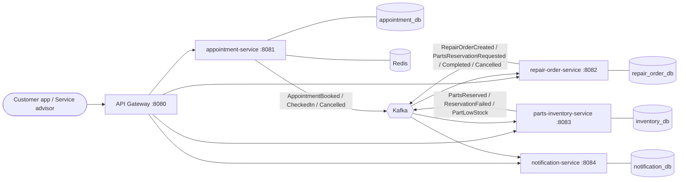
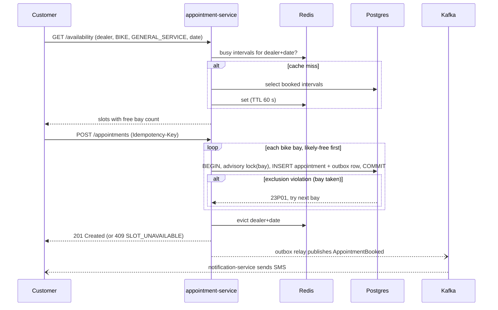
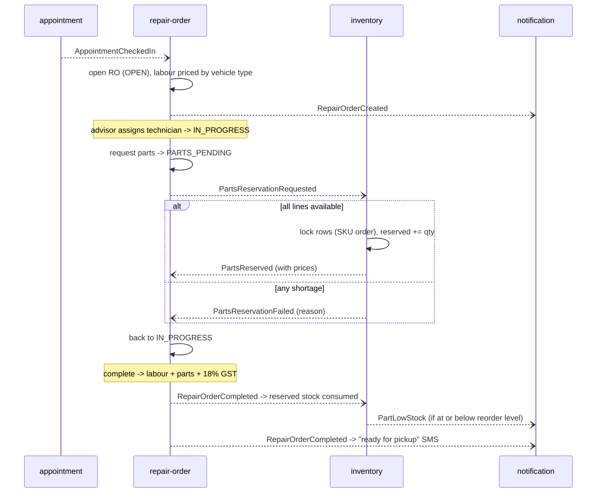

# Torqline: High-Level Design

## 1. Problem

A multi-brand service centre in Bengaluru works on **cars and bikes** in the same building, but a car
lift and a bike stand are not interchangeable. Customers book online, walk in at their slot, and the
workshop opens a job card (repair order), fits parts from the dealer's stock and invoices with GST.

Things that go wrong in real workshops, which this design targets:

| Problem | Consequence | Design response |
|---|---|---|
| Two customers get the same bay at the same time | Angry customers, idle technicians | Database-enforced no-overlap rule per bay |
| App retries a booking after a timeout | Duplicate appointments | `Idempotency-Key` on booking |
| A job card promises a part that is not on the shelf | Vehicle stuck on the lift | Parts reserved before work continues (saga) |
| Booking saved but "confirmed" SMS never sent (or vice versa) | Lost trust | Transactional outbox |
| Availability page hammered at 9 AM | Slow site, DB load | Redis read-through cache |

## 2. Scope

**In:** dealers and bays, slot availability, booking/cancel/check-in, repair-order lifecycle,
parts reservation/consumption, low-stock alerts, customer SMS/email (mocked).

**Out (for now):** authentication, payments, OEM warranty claims, technician scheduling, real SMS gateway.

## 3. Architecture

| Service | Owns | Talks to others via |
|---|---|---|
| **gateway** | Routing, request ids | HTTP |
| **appointment-service** | Dealers, bays, appointments | Publishes appointment events |
| **repair-order-service** | Job cards, part lines, invoice totals | Consumes check-ins and inventory replies; publishes RO events |
| **parts-inventory-service** | Stock per dealer and SKU, reservations | Consumes RO events; publishes inventory events |
| **notification-service** | Sent-message log | Consumes everything, publishes nothing |

**Database per service.** Each service has its own Postgres database (one container locally). No
service reads another's tables; the only coupling is the event contracts in `torqline-common`.

## 4. Key flows

### 4.1 Booking a slot

### 4.2 Check-in to invoice (parts saga)

Cancelling a repair order publishes `RepairOrderCancelled`; inventory **releases** the reservation
(compensating action). Because RO events are keyed by repair-order id, request, complete and cancel
for one order arrive in order on one partition.

## 5. Non-functional requirements

| Concern | Target / approach |
|---|---|
| Correctness under concurrency | Zero double-bookings. Enforced by Postgres, verified by a 50-thread integration test and a k6 race |
| Availability latency | p95 < 150 ms for the availability endpoint; measured **~3 ms p95 at 200 req/s** locally |
| Delivery guarantees | At-least-once events (outbox); exactly-once *effects* (idempotent consumers) |
| Failure isolation | Redis down means availability is served from Postgres (slower, still correct); Kafka down means outbox rows wait and ship later |
| Poison messages | 3 retries, 1 s apart, then routed to `<topic>-dlt` |
| Horizontal scale | All services stateless; outbox relay uses `FOR UPDATE SKIP LOCKED` so N instances can relay together; Kafka topics have 3 partitions |
| Observability | Actuator health/readiness, Prometheus metrics at `/actuator/prometheus`, `X-Request-Id` from the gateway |

## 6. Deployment

- **Local:** `docker compose` (see README). One image per service, built from one multi-stage Dockerfile.
- **Cloud (next step):** EKS or ECS on AWS; RDS Postgres (one instance, database per service), ElastiCache Redis,
  MSK Kafka. Readiness/liveness probes already exposed via Actuator.

## 7. Trade-offs and alternatives considered

| Decision | Alternative | Why |
|---|---|---|
| Postgres exclusion constraint + advisory lock | Redis distributed lock (Redlock) | The DB is already the source of truth; the invariant holds even if code has a bug or Redis fails over. See [ADR-001](adr/001-double-booking-prevention.md) |
| Transactional outbox | Publish to Kafka after commit | Dual-write gap loses or phantom-publishes events. See [ADR-002](adr/002-transactional-outbox.md) |
| Choreographed saga | Central orchestrator service | Only two participants; the repair order already owns the state. Revisit if the flow grows (payments, warranty) |
| Fixed 30-minute grid | Free-form start times | Matches how workshops plan; keeps availability cheap to compute |
| Database per service | Shared schema | Independent deploys and migrations. See [ADR-003](adr/003-database-per-service.md) |
