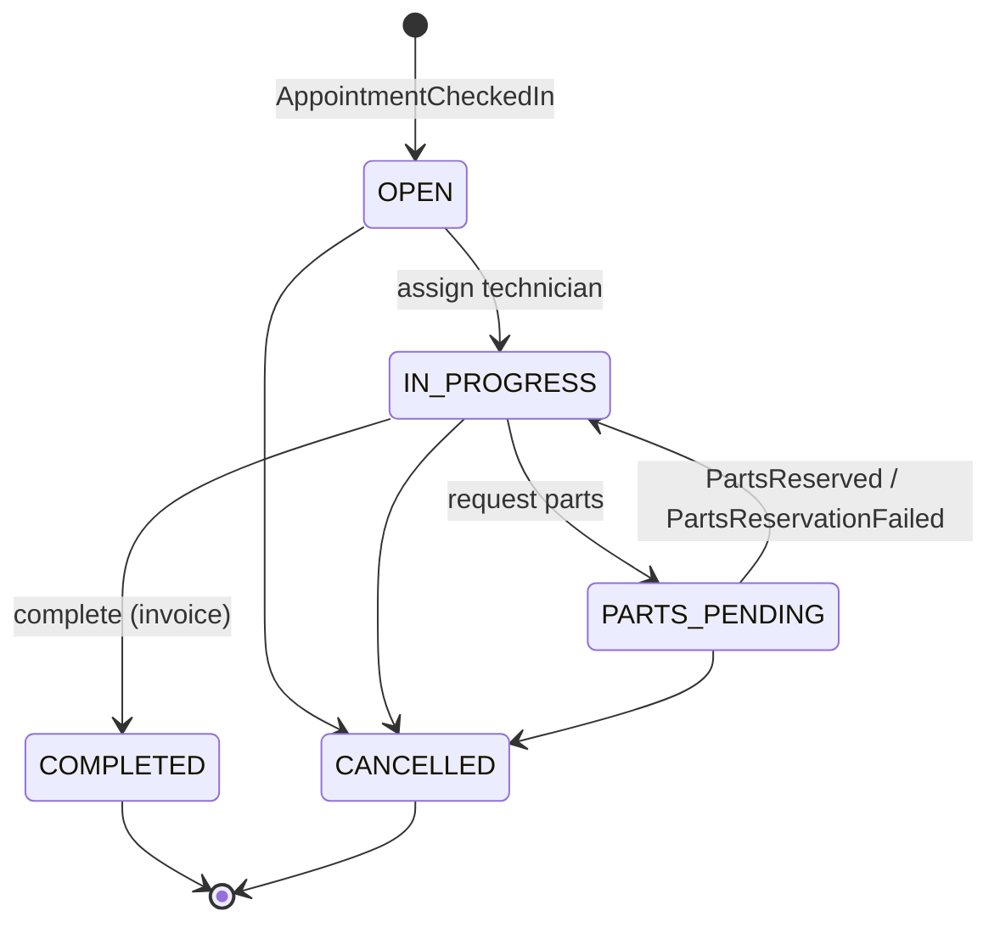

# Torqline: Low-Level Design

## 1. Module layout

```
torqline-common            shared contracts and plumbing, no business logic
  domain/                  VehicleType (labour rate), ServiceType (duration per vehicle type)
  events/                  event records + topic names
  messaging/               OutboxWriter, OutboxRelay, IdempotencyGuard, InboundEvent
  web/                     ApiException + RFC 9457 problem responses
  config/                  Spring Boot auto-configuration that wires the above into every service
appointment-service        dealer/, appointment/, slot/ (pure availability logic + Redis cache)
repair-order-service       order/ (aggregate + state machine), messaging/
parts-inventory-service    part/, reservation/, messaging/
notification-service       templates, sender port, listener
gateway                    Spring Cloud Gateway routes + request-id filter
```

## 2. Domain rules: cars vs bikes

| ServiceType | Car | Bike |
|---|---|---|
| GENERAL_SERVICE | 120 min | 60 min |
| OIL_CHANGE | 30 | 30 |
| BRAKE_SERVICE | 90 | 60 |
| TYRE_REPLACEMENT | 60 | 30 |
| CLUTCH_OVERHAUL | 180 | 90 |
| WHEEL_ALIGNMENT | 60 | not offered |
| AC_SERVICE | 90 | not offered |
| CHAIN_SPROCKET | not offered | 60 |

- A booking can only use a bay of the same `vehicleType`.
- Labour = duration x hourly rate (CAR Rs 800/h, BIKE Rs 400/h). Invoice = labour + reserved parts + 18% GST.
- Parts have a `fitment` of CAR, BIKE or UNIVERSAL (coolant, brake fluid).

## 3. Data model

### appointment_db

```
dealer(id PK, name, city, timezone, open_time, close_time)
service_bay(id PK, dealer_id FK, name, vehicle_type CHECK IN (CAR,BIKE))
appointment(id uuid PK, dealer_id, bay_id FK, customer_*, vehicle_*, service_type,
            slot_start timestamptz, slot_end timestamptz, status, idempotency_key UNIQUE,
            odometer_km, cancel_reason, created_at, updated_at, version)
  EXCLUDE USING gist (bay_id WITH =, tstzrange(slot_start, slot_end, '[)') WITH &&)
          WHERE (status <> 'CANCELLED')
```

The exclusion constraint is the core invariant: a bay can never hold two live, overlapping bookings.
`[)` ranges mean a 10:00-11:00 booking does not conflict with an 11:00-12:00 one. Cancelled rows drop
out of the constraint, so cancelling frees the slot immediately.

### repair_order_db

```
repair_order(id PK, ro_number UNIQUE (RO-<year>-<seq>), appointment_id UNIQUE, dealer_id, customer_*,
             vehicle_*, service_type, status, technician, note,
             labour_amount, parts_amount, tax_amount, total_amount, opened_at, closed_at, version)
part_line(id PK, repair_order_id FK, request_id, sku, name, quantity, unit_price, status)
```

`appointment_id UNIQUE` is a second line of defence against duplicate job cards if an event is
redelivered after the idempotency record was lost.

### inventory_db

```
part(id PK, dealer_id, sku, name, fitment, unit_price, on_hand, reserved, reorder_level, version)
  UNIQUE (dealer_id, sku), CHECK (reserved >= 0 AND reserved <= on_hand)
reservation(id PK, request_id UNIQUE, repair_order_id, dealer_id, status, created_at, settled_at)
reservation_line(reservation_id FK, sku, quantity, unit_price)
```

### Every service

```
outbox_event(id PK, topic, aggregate_type, aggregate_id, event_type, payload jsonb, created_at, published_at)
processed_event(event_id PK, processed_at)
```

## 4. State machines

**Appointment:** `BOOKED -> CHECKED_IN`, `BOOKED -> CANCELLED`. Anything else returns `409 INVALID_STATE`.

**Repair order:**



Transitions live in `RepairOrderStatus.next()`; the aggregate refuses anything else. An inventory reply
for a request that is no longer pending (for example, the order was cancelled meanwhile) is ignored
rather than reopening the order.

**Reservation:** `RESERVED -> CONSUMED` (RO completed) or `RESERVED -> RELEASED` (RO cancelled).

## 5. Concurrency

### 5.1 Booking

1. If an `Idempotency-Key` was already used, return that appointment with `200`.
2. Validate: job offered for vehicle type, on the 30-minute grid, inside opening hours, in the future.
3. Order candidate bays so the ones that look free (from the cached busy list) come first.
4. For each bay, in its **own short transaction**:
   `pg_advisory_xact_lock(7001, bay_id)`, then insert appointment and outbox row, then commit.
   - `23P01` exclusion violation: bay taken, try the next bay.
   - `23505` on the idempotency key: a concurrent retry won, return its result.
5. No bay left: `409 SLOT_UNAVAILABLE`.

**Why the advisory lock:** with the exclusion constraint alone, two transactions inserting overlapping
rows for the same bay at the same instant each wait for the other's uncommitted row while checking the
constraint, so Postgres detects a deadlock and aborts one after `deadlock_timeout` (1 s). Under the k6
race this turned 46 clean `409`s into deadlock `500`s and starved the connection pool. The lock
serialises inserts **per bay only**. A transaction holds at most one such lock, so no cycle is possible.
Correctness still comes from the constraint; the lock only removes the deadlock.

### 5.2 Parts reservation

`SELECT ... FOR UPDATE` on all requested SKUs, **ordered by SKU**, then check availability and update.
Consistent lock order prevents deadlocks between two repair orders that need overlapping parts. The
reservation is all-or-nothing: a shortage on any line reserves nothing and returns a reason listing
every short line. The `ck_part_stock` CHECK is a final guard against overselling.

### 5.3 Optimistic locking

Aggregates carry `@Version`. Two advisors completing the same repair order at once get
`409 CONCURRENT_MODIFICATION` instead of a silent lost update.

## 6. Messaging

| Topic | Key | Events |
|---|---|---|
| `torqline.appointment.events` | appointment id | AppointmentBooked, AppointmentCancelled, AppointmentCheckedIn |
| `torqline.repair-order.events` | repair-order id | RepairOrderCreated, PartsReservationRequested, RepairOrderCompleted, RepairOrderCancelled |
| `torqline.inventory.events` | repair-order id or dealer:sku | PartsReserved, PartsReservationFailed, PartLowStock |

- **Envelope:** the value is JSON; headers carry `eventId` (the outbox row id) and `eventType` (record name).
  Plain strings on the wire keep services independent of each other's class names.
- **Producer:** `OutboxWriter.append()` refuses to run outside a transaction. `OutboxRelay` polls every
  500 ms, takes up to 100 rows with `FOR UPDATE SKIP LOCKED`, sends them, waits for all acks, then marks
  them published. Any failure rolls back the batch, which is retried later (at-least-once).
- **Consumer:** `IdempotencyGuard.processOnce(eventId, handler)` inserts into `processed_event` with
  `ON CONFLICT DO NOTHING` in the same transaction as the handler. A duplicate is skipped; if the
  handler fails, the marker rolls back too and the retry runs cleanly.
- **Errors:** `DefaultErrorHandler` with 3 retries then `DeadLetterPublishingRecoverer` to `<topic>-dlt`.

## 7. Caching

`BusySlotCache` stores a dealer's booked `(bayId, start, end)` intervals per day under
`torqline:busy:<dealer>:<date>` for 60 s. Availability for any vehicle or service type is computed from
that list plus the bay list, so one cache entry serves every query for that dealer and day, and one
delete evicts it after a booking, cancellation or check-in.

Known staleness window: a reader that loaded from Postgres just before a booking committed can write
the old list back after the eviction. The UI may then show a slot that is actually taken for up to
the TTL; booking it returns `409`. This is acceptable because the cache never decides a booking.

Redis errors are logged and fall back to Postgres.

## 8. API

| Method | Path | Notes |
|---|---|---|
| GET | `/api/dealers`, `/api/dealers/{id}`, `/api/dealers/{id}/bays` | |
| GET | `/api/dealers/service-types` | Durations per vehicle type |
| GET | `/api/appointments/availability?dealerId&vehicleType&serviceType&date` | |
| POST | `/api/appointments` | `Idempotency-Key` header; 201 new, 200 replay, 409 full |
| GET | `/api/appointments?dealerId&date`, `/api/appointments/{id}` | |
| POST | `/api/appointments/{id}/check-in`, `/api/appointments/{id}/cancel` | |
| GET | `/api/repair-orders?dealerId[&status]`, `/api/repair-orders/{id}` | |
| POST | `/api/repair-orders/{id}/assign`, `/parts` (202), `/complete`, `/cancel` | |
| GET | `/api/parts?dealerId[&fitment]`, `/api/parts/low-stock`, `/api/parts/{dealer}/{sku}` | |
| POST | `/api/parts/{dealer}/{sku}/restock` | |
| GET | `/api/reservations?repairOrderId`, `/api/notifications[?recipient]` | |

Errors use RFC 9457 `ProblemDetail` with a stable `code`, for example:

```json
{ "status": 409, "code": "SLOT_UNAVAILABLE", "detail": "No BIKE bay is free at 2026-09-27T10:00 for GENERAL_SERVICE" }
```

## 9. Testing

See [TESTING.md](TESTING.md) for the full list. In short: 59 backend tests (unit, MockMvc, and Testcontainers
race tests against real PostgreSQL), 29 frontend tests (Vitest + React Testing Library), a 13-step end-to-end
script, and a k6 race and throughput test.

## 10. Web UI

React 19 + TypeScript, built with Vite and served by nginx, which also proxies `/api` to the gateway so there's
no CORS. There's no client-side state library: each screen polls the API (1.5-3 s) while the tab is visible,
which is enough to watch asynchronous saga steps land. `index.html` is served with `Cache-Control: no-cache` and
hashed assets as immutable, so a rebuild is picked up on the next reload. Invoices print from a dedicated
`#/invoice/<id>` page rather than from a dialog.
