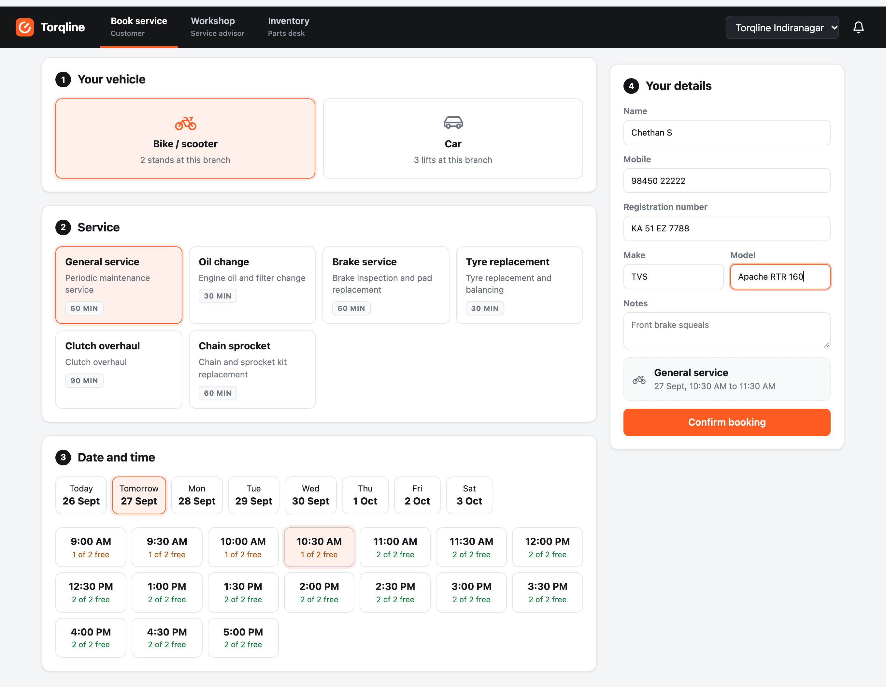
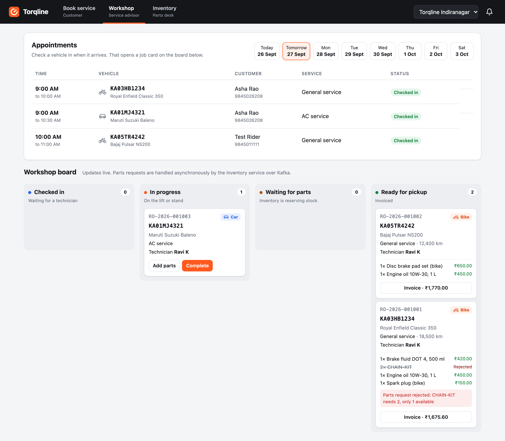
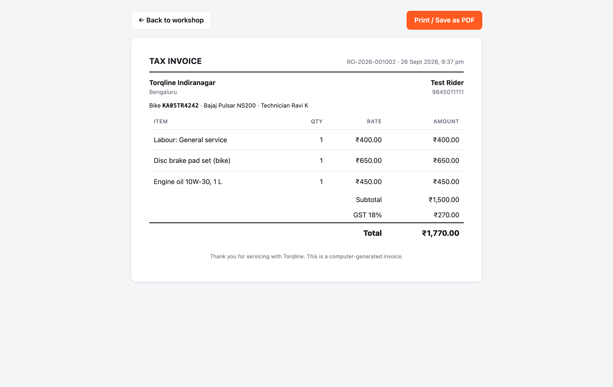
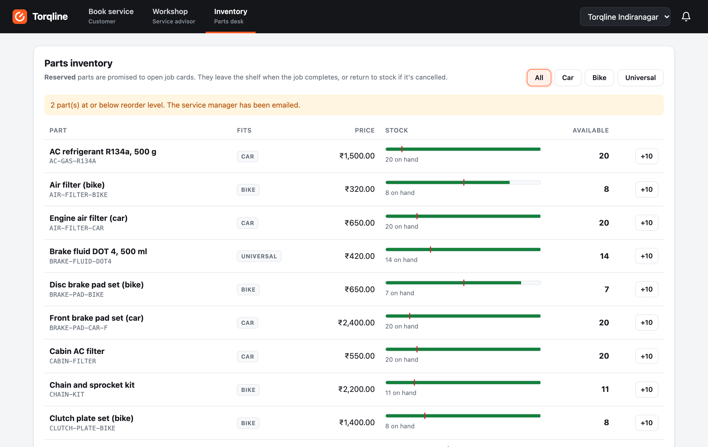
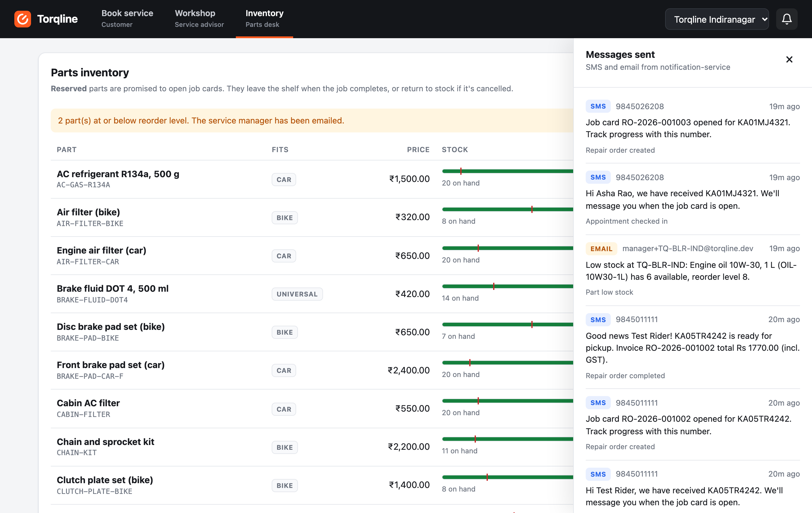

# Torqline user guide

Torqline has three screens, one per role, plus a live message feed. Switch screens with the tabs at the top, and
switch branch with the dropdown in the top-right corner.

Open the app at **http://localhost:3000** after `make up`.

## Seeded data

| Branch | Car lifts | Bike stands | Hours (IST) | Notes |
|---|---|---|---|---|
| **Torqline Indiranagar** (`TQ-BLR-IND`) | 3 | 2 | 09:00-18:00 | Car-heavy; only 1 chain kit in stock |
| **Torqline Whitefield** (`TQ-BLR-WHF`) | 2 | 4 | 09:00-19:00 | Bike-heavy |

Each branch stocks 16 parts: 7 for cars, 7 for bikes and 2 universal (coolant, brake fluid).

---

## 1. Book service (customer)



1. **Your vehicle**: choose *Bike / scooter* or *Car*. The card shows how many stands or lifts the branch has.
2. **Service**: only services that apply to your vehicle appear. A bike sees *Chain sprocket*; a car sees
   *Wheel alignment* and *AC service*. Each card shows how long the job takes for that vehicle.
3. **Date and time**: pick a day, then a slot. Each slot shows how many bays are free:
   - green, *2 of 2 free*: plenty of room
   - amber, *1 of 2 free*: last bay
   - grey, *Full*: can't be booked
4. **Your details**: name, 10-digit mobile number and registration number are required; make, model and notes are optional.
5. **Confirm booking**. You get a reference number, the bay, and an SMS (open the 🔔 to see it).

**What happens behind the scenes**

- If someone else takes the last bay while you're filling in the form, you'll see *No BIKE bay is free at …* and the
  slot grid refreshes. You can never be double-booked.
- Pressing **Confirm** twice, or a retry after a network timeout, doesn't create two bookings. Each attempt carries
  an idempotency key and the server returns the original booking.

## 2. Workshop (service advisor)



### Appointments

Pick a day to see its appointments. For a vehicle that has arrived:

- type the **odometer** reading (optional) and click **Check in**, or
- click **Cancel** if the customer doesn't turn up. That frees the bay immediately.

Checking in sends an event to the repair-order service, which opens a **job card** on the board within a second or two.

### Workshop board

| Column | Meaning | Actions |
|---|---|---|
| **Checked in** | Job card open, nobody assigned | Choose a technician → **Start work** |
| **In progress** | On the lift or stand | **Add parts**, **Complete** |
| **Waiting for parts** | Inventory is reserving stock | None; wait for it to move back automatically |
| **Ready for pickup** | Completed and invoiced | **Invoice** |

**Adding parts:** the picker lists only parts that fit the vehicle, plus universal ones, with live stock. Choose
quantities with − / + and click **Request parts**. The card moves to *Waiting for parts* and then back to
*In progress*:

- **Reserved** lines show in green with their price.
- If *any* line is short, the **whole request is rejected** (struck through in red) with a reason, for example
  *CHAIN-KIT needs 2, only 1 available*. Nothing is reserved, so you can request again with different quantities.

**Completing** prices the job:

```
labour  = job duration × labour rate (car ₹800/h, bike ₹400/h)
parts   = sum of reserved lines
GST     = 18% of (labour + parts)
total   = labour + parts + GST
```

Rejected parts are never charged.

### Invoice and printing

**Invoice** shows the itemised bill. **Print** opens a clean, printable invoice page in a new tab and brings up the
print dialog. Choose *Save as PDF* to keep a copy. To remove the date and URL that Chrome adds, untick
**More settings → Headers and footers**.



## 3. Inventory (parts desk)



- **Filter** by Car, Bike or Universal.
- The **stock bar** shows available (green) and reserved (amber) stock, with the reorder level as a red marker.
- **Reserved** stock is promised to open job cards. It leaves the shelf when the job completes and returns if the job is cancelled.
- Rows at or below the reorder level are highlighted, and the service manager is emailed automatically.
- **+10** restocks a part.

## 4. Messages (🔔)



Every message the notification service sent, newest first, updating live:

| When | Channel | To |
|---|---|---|
| Appointment booked, cancelled, checked in | SMS | Customer |
| Job card opened, job completed (with invoice total) | SMS | Customer |
| Part at or below reorder level | Email | `manager+<branch>@torqline.dev` |

Messages are logged rather than actually sent. Swapping in a real SMS gateway means implementing one interface
(`NotificationSender`).

## Walkthroughs

**Race for the last bay:** open *Book service* in two browser windows, pick the same bike slot at Indiranagar
(2 stands), and confirm in both. Do it once more in a third window. The third booking is refused.

**Stock-out:** check in a bike at Indiranagar, start work, and request **2 × Chain and sprocket kit**. The request is
rejected because only 1 is in stock. Go to **Inventory**, click **+10** on the chain kit, then request again. This time it's reserved.

**Cancel with parts reserved:** reserve parts on a job, then cancel it through the API
(`POST /api/repair-orders/{id}/cancel`). On the Inventory screen the reserved quantity returns to available.
